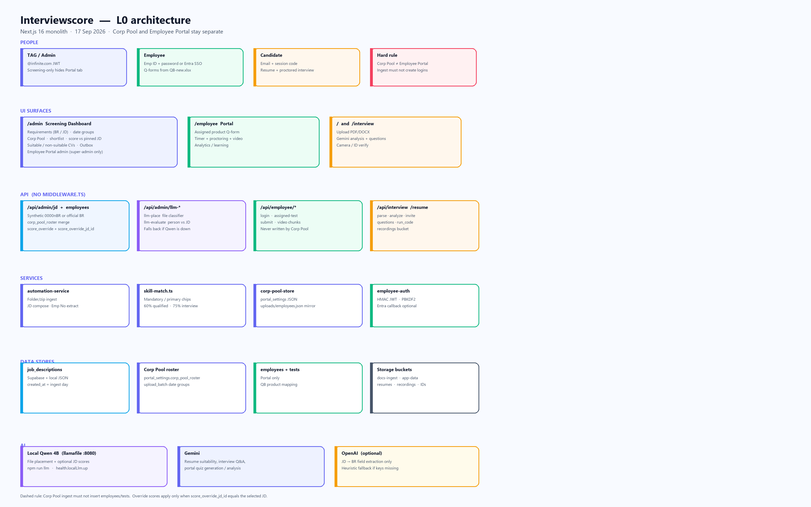

# AI Interview / Interviewscore — Level 0 (L0) System Architecture

**Document version:** 2.0  
**Codebase:** `resume-intelligence-platform` (Next.js 16 monolith)  
**Method:** Derived from source as of 17 Sep 2026 — supersedes the July 2026 L0 draft in this folder  
**Related:** [PRD.md](./PRD.md) · [rules.md](./rules.md) · [phases.md](./phases.md) · [design.md](./design.md) · [memory.md](./memory.md)

---

## Executive Summary

Interviewscore is a **Next.js 16 full-stack monolith** with three product surfaces in one deployable unit:

1. **Screening Dashboard (`/admin`)** — Requirements (BR/JD), Corp Pool, candidate CV suitability, optional Employee Portal admin
2. **Employee Portal (`/employee`)** — product Q-forms, learning, proctored recordings
3. **Candidate interview (`/`, `/interview/[id]`)** — resume upload, Gemini analysis, proctored mock interview

**Hard split:** Corp Pool (bench screening) and Employee Portal (logins + tests) are different rosters. Ingesting resumes must never create portal users. See [rules.md](./rules.md).

Persistence is **Supabase PostgreSQL** plus **Supabase Storage**. There is **no** `middleware.ts` and **no** Server Actions. Auth is **HMAC JWT** (employees + admins). Microsoft Entra SSO is optional on the employee portal only.

AI stack:

| Role | Engine |
|------|--------|
| Resume / interview / portal quiz | Google Gemini (`src/lib/gemini-ai.ts`) |
| JD → BR fields | OpenAI, optional (`src/lib/jd-to-br/aiService.ts`) |
| On-box scoring + file classify | **Local Qwen 4B** llamafile (`src/lib/local-llm.ts`, `npm run llm`) |
| Always-on numeric fallback | `src/lib/skill-match.ts` + `LocalAIEngine` |

---

## Architecture Diagram



Source: [`architecture.mmd`](./architecture.mmd). Regenerate PNG (if mermaid-cli is installed):

```bash
npx @mermaid-js/mermaid-cli -i "docs/IMP Docs/architecture.mmd" -o "docs/IMP Docs/architecture.png" -b white -w 3200
```

---

## 1. Client Layer

| Component | Technology | Evidence |
|-----------|------------|----------|
| Framework | **Next.js 16.2** App Router + **React 18.3** | `package.json`, `src/app/**/page.tsx` |
| UI | **Tailwind CSS 3.4**, CVA, Lucide, Radix Slot | `src/app/globals.css`, `src/components/ui` |
| Motion / charts | Framer Motion 12, Recharts 3 | Employee dashboard |
| Upload UX | react-dropzone | Resume / unified upload |
| Browser | Camera + microphone | `Permissions-Policy` in `next.config.mjs` |

### Routes

| Route | Audience | Purpose |
|-------|----------|---------|
| `/admin` | TAG / HR | Screening Dashboard |
| `/admin/resumes/[id]` | Admin | One candidate CV |
| `/employee`, `/employee/dashboard` | Employee | Portal home |
| `/employee/tests/[id]` | Employee | Timed Q-form |
| `/employee/learn`, `/employee/learn/[id]` | Employee | Curriculum + AI quiz |
| `/` | Candidate | Email gate |
| `/interview/[id]` | Candidate | Proctored interview |

### Authentication

| Actor | Mechanism | Storage |
|-------|-----------|---------|
| Admin | `@infinite.com` + password → HMAC JWT (~1 h) | `localStorage` (`AdminAuthGate`) |
| Screening-only admin | Named emails; **no Employee Portal tab** | Same JWT, claims in `admin-accounts-server.ts` |
| Employee | Emp ID + PBKDF2 password → HMAC JWT (~7 d) | `localStorage` |
| Employee SSO | Microsoft Entra (`MICROSOFT_CLIENT_*`) | Same JWT after callback |
| Candidate | Email + session code | Session-bound, no JWT |

---

## 2. Backend Layer

All backend is **Route Handlers** under `src/app/api/` (~82 handlers). Zero `"use server"` in `src/`.

### Route groups

| Prefix | Responsibility |
|--------|----------------|
| `/api/admin/jd` | Create / list / delete requirements |
| `/api/admin/employees` | Corp Pool CRUD, shortlist, export, reset-test (portal), llm-evaluate, import-scores |
| `/api/admin/files/llm-place` | Classify an upload (corp pool vs JD vs portal mapping) |
| `/api/admin/refresh`, `upload_unified` | Folder / category ingest |
| `/api/admin/resumes/*` | Candidate CVs, invite, suitability override |
| `/api/employee/*` | Login, assigned-test, submit, video, learning |
| `/api/interview/*` | Candidate interview lifecycle |
| `/api/resume/*` | Parse / analyze / enhance / report |
| `/api/health` | Liveness + `localLlm.up` |

### Services (`src/services/`)

| Service | Responsibility |
|---------|----------------|
| `automation-service.ts` | Docs ingest, Corp Pool parse, JD-to-BR |
| `resume-service.ts` | PDF/DOCX extract, Gemini analysis, `resumes` CRUD |
| `interview-service.ts` | Questions, evaluation |
| `employee-account-store.ts` | Portal credentials |
| `local-tests-db.ts` | Tests + JSON fallback |
| `resource-mapping-service.ts` | Excel mapping for portal admin view |
| `audit-log-service.ts` | `audit_logs` |
| `employee-test-supabase-sync.ts` | Portal test sync |

### Libraries (`src/lib/`)

| Module | Responsibility |
|--------|----------------|
| `corp-pool-store.ts` | Load/save `corp_pool_roster` |
| `corp-pool-llm.ts` | Qwen classify + person-vs-JD JSON |
| `skill-match.ts` | Recruiter % score, 60% qualified bar, override-by-JD |
| `deleted-requirements.ts` | Tombstones + `nextSyntheticBrId` (`00001BR`…) |
| `deleted-corp-pool.ts` | Soft-deleted Emp IDs |
| `local-llm.ts` | llamafile OpenAI-compatible client |
| `gemini-ai.ts` | Gemini wrapper |
| `employee-auth.ts` | HMAC JWT, PBKDF2 |
| `security.ts` | CSRF, IP rate limit, magic-byte upload check |

**No `middleware.ts`.** Auth is per-route.

---

## 3. Database — Supabase PostgreSQL

**Client:** `@supabase/supabase-js` via `src/lib/db.ts`  
**Server:** `SUPABASE_SERVICE_ROLE_KEY` (bypasses RLS)  
**Schema:** `docs/supabase-schema/master-azure-migration.sql`

### Domain model

```
CANDIDATE
  resumes ── interview_questions / interview_attempts / candidate_sessions

ADMIN / HR
  job_descriptions
  portal_settings          ← corp_pool_roster, deleted_*, admin accounts
  audit_logs, reset_logs, simulated_emails

EMPLOYEE PORTAL  (separate from Corp Pool)
  employees ── tests ── test_questions / test_attempts
  VIEW employee_test_results

LEARNING
  learning_subjects → modules → topics → resources
```

Corp Pool people are **not** rows in `employees`. They are JSON inside `portal_settings` (`key = corp_pool_roster`).

### Local / cloud JSON mirrors

`uploads/job_descriptions.json`, `uploads/employees.json`, `src/data/employee-accounts.json`, `employee_test_manifest.json`, `local_tests_db.json`. Production treats Supabase as source of truth (`allowLocalDataFallback`).

---

## 4. Storage

| Bucket | Content |
|--------|---------|
| `resumes` | Candidate CV binaries |
| `recordings` | Interview + employee test `.webm` |
| `verifications` | ID / selfie |
| `app-data` | Runtime JSON (roster, manifests) |
| `docs-ingest` | BR / JD / Corp Pool files (`Corp Pool/…`) |

Filesystem: `uploads/` (dev), `/tmp` (Vercel), `/app/uploads` (Azure), `docs/JD`, `docs/BR - Interviewscore App`.

---

## 5. AI Services

### Local Qwen 4B (`LOCAL_LLM_URL`, default `http://127.0.0.1:8080`)

llamafile (`AI/start.bat`). Used for:

- Classifying an uploaded file (corp pool vs JD vs portal mapping)
- Optional person-vs-JD JSON scores (`scorePersonAgainstJdsWithLlm`)

Not a substitute for `skill-match` when the daemon is down.

### Google Gemini (`GEMINI_API_KEY`)

Resume suitability, interview Q&A, code-run assistance, portal MCQ + analysis, learning quizzes.

### OpenAI (`OPENAI_API_KEY`)

JD structured extraction for BR Excel only.

### Heuristic fallback

`src/lib/local-ai.ts` and `skill-match.ts` (mandatory/primary skills, job family, years/title).

---

## 6. Data flows

### 6.1 Requirements ingest

```
Admin or script
  → compose JD with Job Title: + Mandatory Skills:
  → official BR or nextSyntheticBrId
  → UPSERT job_descriptions (created_at = ingest day)
  → uploads/job_descriptions.json
```

Vector Brassring PDFs: render pages → human/agent OCR → text file. Empty `pdf-parse` output is not a valid JD.

### 6.2 Corp Pool ingest

```
Resumes / zip / Excel
  → extractText (pdf / docx / doc)
  → Emp No from resume / filename / list
  → MERGE into corp_pool_roster by employee_id
  → new upload_batch for people in THIS file only
  → employees.json + Storage app-data
```

Does **not** insert `employees` or `tests`.

### 6.3 Score vs pinned JD

```
Select JD in admin
  → skill-match(profile, jd_text) unless
    score_override_jd_id === selected JD
  → optional Qwen / intelligent script
  → write score + score_override + score_override_jd_id
```

### 6.4 Employee Q-form

```
Workbook + QB-new.xlsx
  → employees row + hashed password
  → tests + test_questions for that product
  → employee logs in → assigned-test → submit → recordings
```

### 6.5 Candidate screening

Unchanged from v1: upload → parse → Gemini/LocalAI → optional interview → report.

---

## 7. Security

| Layer | Implementation |
|-------|----------------|
| Admin | `@infinite.com` + password; screening-only flag hides portal |
| Employee | PBKDF2 + HMAC JWT; optional Entra SSO |
| CSRF | Origin/referer on mutating admin routes |
| Uploads | Magic-byte sniff (`inspectUpload`) |
| Rate limit | In-memory per IP (login, upload) |
| Headers | CSP, DENY frame, HSTS, camera/mic policy |
| Secrets | `.env.local` only; never `NEXT_PUBLIC_` for service role / JWT / SMTP / LLM key |

RLS exists on tables for `auth.uid()`, but the app uses the **service role**, so RLS is not the enforcement path today.

---

## 8. Deployment

| Tier | Target |
|------|--------|
| App | Vercel (`VERCEL=1`) or Azure Container Apps (`Dockerfile`, `CONTAINER=1`) |
| DB / files | Supabase Postgres + Storage |
| Local LLM | Same machine or sidecar; not Vercel serverless |
| Dev | `npm run dev` + optional `npm run llm` |

Flags: `USE_SUPABASE_PRIMARY`, `DOCS_USE_CLOUD`, `ALLOW_INSECURE_TLS` (corp proxy only).

---

## 9. Stack summary

| Layer | Stack |
|-------|--------|
| Runtime | Node ≥ 18 |
| App | Next.js 16 App Router, TypeScript 5.6 |
| UI | React 18, Tailwind, Radix, Framer, Recharts |
| Data | Supabase Postgres + Storage; JSON fallback |
| AI | Gemini, optional OpenAI, local Qwen 4B, skill-match |
| Files | pdf-parse, mammoth, exceljs, adm-zip |
| Mail | nodemailer |
| Biometrics | face-api / Python OpenCV (candidate only) |

---

## Appendix: where to change what

| If you need to… | Start here |
|-----------------|------------|
| Add a JD under today’s date | `src/app/api/admin/jd/route.ts` or a `scripts/add-*-jd.ts` |
| Add Corp Pool people as a new batch | `automation-service` ingest or `scripts/add-*-corp*.ts`; set `upload_batch` |
| Change % scoring rules | `src/lib/skill-match.ts` |
| Keep portal safe | Never write `employees` / `tests` from Corp Pool scripts |
| Show/hide portal tab | `adminCanViewOrgScreeningData` / `canViewEmployeePortal` |

*Re-validate this document after a major ingest model or auth change.*
